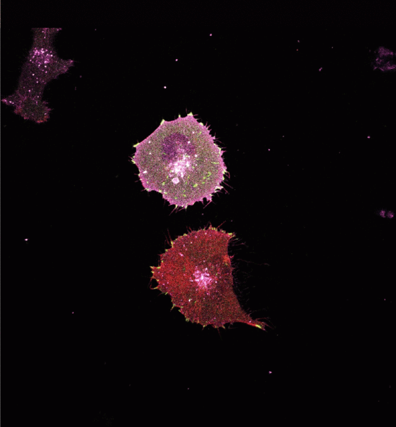
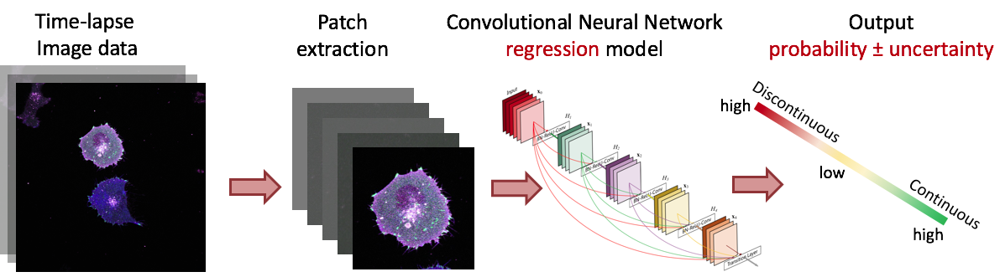
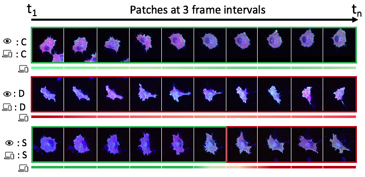
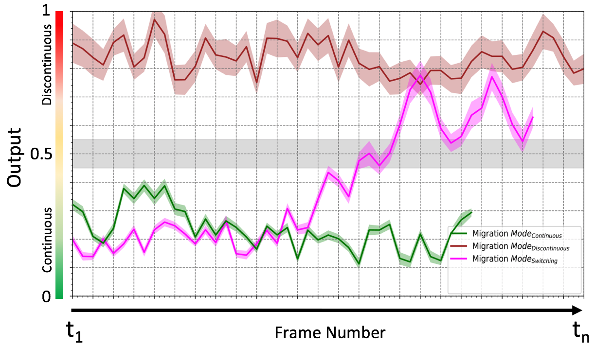
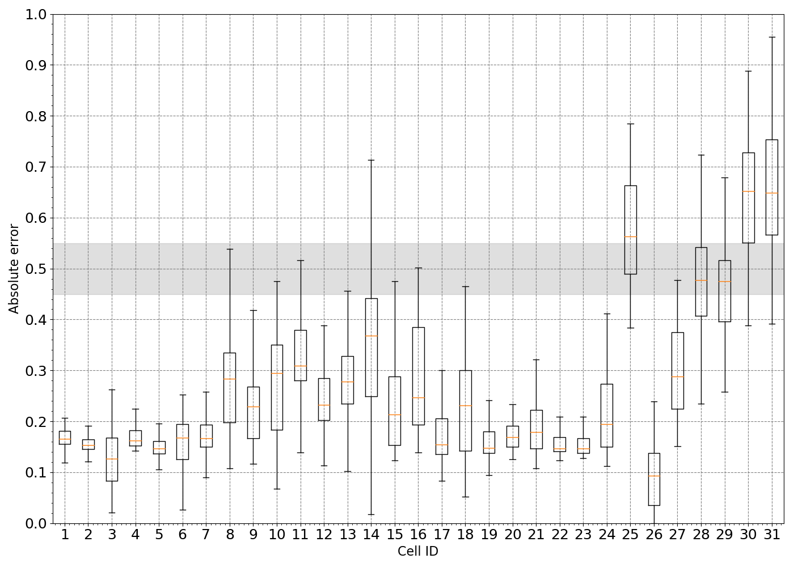

# Cell Migration Mode Prediction for High Magnification Images 

Cell migration is a complex and heterogeneous phenomenon consisting of many spatially and
temporally regulated mechanisms. 
A complete understanding of cell migration phenomenon is indeed crucial to derive an 
adequate quantification for single cell-based analysis. 
However, the spatiotemporal behavior of dynamic cells is often complex and challenging for 
manual classification and analysis.\,Automatized algorithms are thus highly 
desired to facilitate mesenchymal migration sub-modalities prediction. 
Supervised deep learning techniques have shown promising outcomes in microscopy image 
analysis. However, their implication is confided by the amount of carefully annotated data.
Weak supervision provides a simple, model-agnostic way to integrate the domain-expertise   
into a learning model. 
Additionally, bayesian predicitons can lead to a more informed decision, and the quality 
of prediction can be improved.
Currently, this study employs a Bayesian CNN regression model for predicting (or classifying) the probability of each cell observation. 

<h6>Examples of two cells </h6>
<p align="center">
  
</p>


```
High-resolution confocal images of a two cell during migration in the Discontinuous and Continuous mode when treated with 10 mg/ml fibronectin concentration.
```   






## Project
[Deciphering Cancer Cell Migration by Systems Microscopy](https://sysmic.ki.se) 


## Contributing
Pull requests are welcome. For major changes, please open an issue first to 
discuss what you would like to change. Please make sure to update tests as appropriate.

## License
[MIT](https://choosealicense.com/licenses/mit/) 

## Authors

* [Wählby Lab](http://user.it.uu.se/~cli05194/research_n_support.html)
* [Anindya Gupta](https://www.it.uu.se/katalog/anigu165)

## Acknowledgments

* [Strömblad Group](https://ki.se/en/bionut/cell-biology-of-cancer-staffan-stromblad-0)
